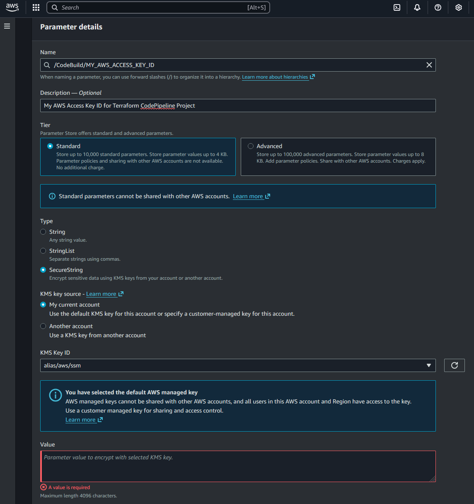

# Introduction

1. Infrastructure is defined in Terraform code and is being run from GitHub using AWS CodePipeline.
2. Infrastructure

- VPC (Multi-AZ)
- IAM
- Security Groups
    - Bastion Host
    - Private
    - Load Balancer
- EC2 Instances
    - Single EC2 Instance for Bastion Host
    - Other instances managed with AutoScaling Group and Launch Template
- Application Load Balancer
    - Fixed response
    - Host-based routing based on path pattern
    - HTTPS redirection
- ACM TLS Certificate
- Route53 DNS Registration
- AutoScaling
    - Target Tracking (AVG CPU Load, AVG LB Connections to single target)
    - Scheduled
- Backend for Remote State Storage
- DynamoDB State Lock - Optional - Not required as only single instance of pipeline can run at a given time

3. Multiple environments managed by their respective configuration files.

- AWS CodeBuild
- AWS CodePipeline
- Github

# Architecture


# Configuration / Use

| Variable          | File          | Comment                     |
| ----------------- | ------------- | --------------------------- |
| `dns_name`        | env_\*.tfvars |                             |
| `environment`     | env_\*.tfvars |                             |
| `bucket`<br>`key` | env_\*.conf   | Backend config for .tfstate |
| `region`          | env_\*.conf   |                             |
| `AWS_ACCESS_KEY_ID`<br>`AWS_SECRET_ACCESS_KEY`          | buildspec-\*.conf   | AWS Access Keys for GitHub and AWS CodePipeline                            |

#### 1. Deploy `aws-codepipelines`

```
cd terraform-core\aws-codepipelines
terraform init
terraform plan
terraform apply
```

#### 2. Modify config files accordingly

Buildspec can apply or destroy the environment.

Set the `TF_COMMAND` in `terraform-iac-aws-cp1\terraform\manifests\buildspec-ENV.yml`.

#### 3. Deploy the infrastructure

In AWS Console:

- Check for pipelines being created and follow the logs to ensure no errors and infrastructure has been deployed.

```
Developer Tools > CodePipeline > Pipelines
```

#### 4. Test the application

Check `dns_name` in `env_\*.tfvars` file, copy the URi and test the application.

## Dependencies

| Repository        | Terraform           | Comment                     |
| ----------------- | -------------       | --------------------------- |
| `terraform-core`  | `aws-backends`      |  S3 Bucket must be present for Terraform S3 backends to work (as configured in `env_\*.conf`, see above).                           |
| `terraform-core`  | `aws-codepipelines` |  CodePipeline is being created with Terraform. See README in `aws-codepipelines` for more information.                          |

## Manual steps

### AWS Keys in Parameter store

For GitHub -> AWS connectivity, AWS Keys must be generated and stored in the Parameter Store.

#### 1. Generate Access Keys

```
IAM > Users > SELECT_USER > Security credentials tab > Create access key
```
#### 2. Upload Generated Access Keys to AWS Parameter store

>**Parameter Store** is a tool in **AWS Systems Manager** for secure, hierarchical storage of configuration data and secrets, like passwords and database strings.<br><br>
>_More info:_
> - [Systems Manager Parameter Store](https://robk.uk/posts/training/aws/2025-aws-cloud-practitioner/14-deployments/#systems-manager-parameter-store)
> - [Systems Manager SSM](https://robk.uk/posts/training/aws/2025-aws-cloud-practitioner/14-deployments/#systems-manager-ssm)

Upload Keys to Parameter Store:

```
Systems Manager > Application Tools > Parameter Store
```



```
Name: /CodeBuild/MY_AWS_ACCESS_KEY_ID
Descritpion: My AWS Access Key ID for Terraform CodePipeline Project
Tier: Standard
Type: Secure String
Rest all defaults
Value: VALUE_OF_MY_AWS_ACCESS_KEY_ID (Generated below, IAM)
```

```
Name: /CodeBuild/MY_AWS_SECRET_ACCESS_KEY
Descritpion: My AWS Secret Access Key for Terraform CodePipeline Project
Tier: Standard
Type: Secure String
Rest all defaults
Value: VALUE_OF_MY_AWS_SECRET_ACCESS_KEY (Generated below, IAM)
```

_AWS Parameter Store:_ https://docs.aws.amazon.com/systems-manager/latest/userguide/systems-manager-parameter-store.html

### CloudWatch Log Groups

During the Pipeline execution, **Log Groups** are created in **CloudWatch**. Those logs will be kept forever if not deleted. Retention settings can be adjusted.

```
CloudWatch > Logs > Log Groups
```

Log Group names are defined in `terraform-core\aws-codepipelines` repository as those are created for the **AWS CodePipeline**.

## CICD / Pipeline region-specific configuration files

### Building new region

- Add region-specifig Terraform configurations:
    - `terraform-manifests\env_NEWENVIRONMENT.conf`
    - `terraform-manifests\env_NEWENVIRONMENT.tfvars`
    - `buildspeck-NEWENVIRONMENT.yml`
- Configure region-specific codebuild (`terraform-core\aws-codepipelines`)
- Configure region-specific codepipeline (`terraform-core\aws-codepipelines`)

# TODO

- Storing and distributing EC2 private key in AWS SSM

    SSH key is not being copied to the Bastion Host. It would have to be copied manually if connecting to the private app servers was required.

- Load Balancer connections policy throws an error when running first time

`"aws_autoscaling_policy" "alb_target_requests_greater_than_yy"` in `c13-06-autoscaling-ttsp.tf` needs to be corrected (wait?). It is throwing routing errors when deployed first time. It is ok on the second run.

- Modularize the environment for codebuild
- Manual Approval Stage

# Disclaimer

This series draws heavily from **Kalyan Reddy Daida**’s [Terraform on AWS with SRE & IaC DevOps](https://www.udemy.com/course/terraform-on-aws-with-sre-iac-devops-real-world-demos/) course on Udemy.

[His content](https://www.udemy.com/user/kalyan-reddy-9/) was a game-changer in helping me understand Terraform.

<!-- About the instructor -->

<table>
  <thead>
      <tr>
          <th>About the instructor</th>
          <th></th>
      </tr>
  </thead>
  <tbody>
      <tr>
          <td>🌐 <a href="https://stacksimplify.com/" target="_blank" rel="noreferrer">Website</a>
</td>
          <td>📺 <a href="http://www.youtube.com/stacksimplify" target="_blank" rel="noreferrer">YouTube</a>
</td>
      </tr>
      <tr>
          <td>💼 <a href="http://www.linkedin.com/in/kalyan-reddy-daida" target="_blank" rel="noreferrer">LinkedIn</a>
</td>
          <td>🗃️ <a href="https://github.com/stacksimplify" target="_blank" rel="noreferrer">GitHub</a>
</td>
      </tr>
  </tbody>
</table>

<!-- /About the instructor -->
